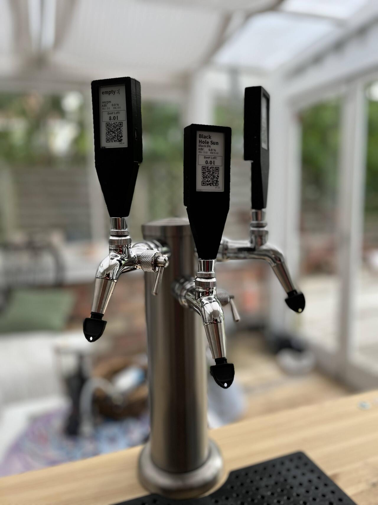
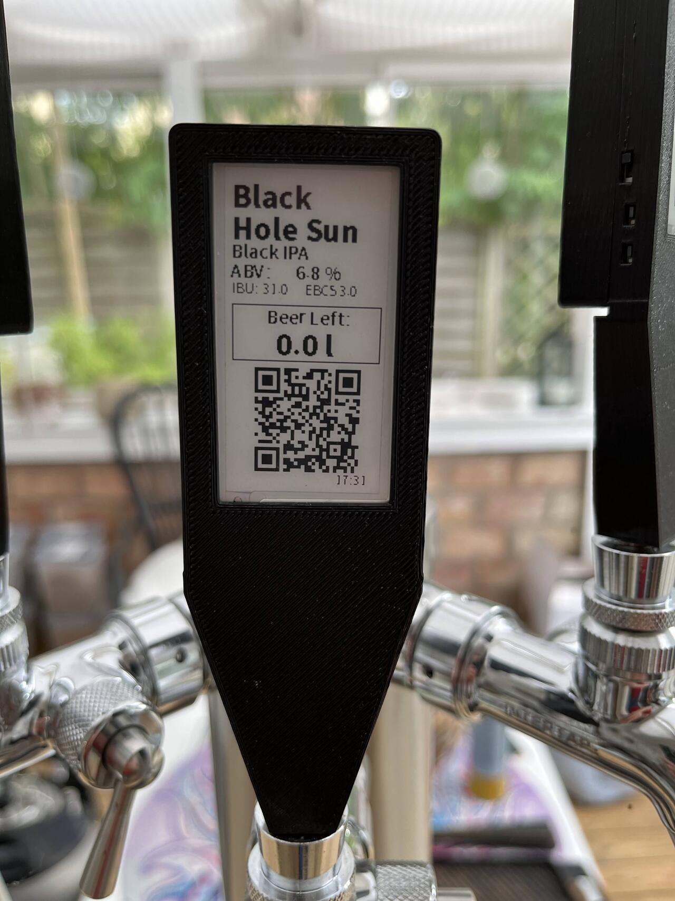

# Smart Beer Taps
ESP based smart beer taps with eInk screens

## Background
I am a homebrewer, and a home automation enthusiast.

I use kegs for serving my beers, since I don't fancy filling bottles with all that hassle. I have a tap tower, with three taps. Then I wanted to know how much beer is left in the kegs, as well as what beer is in what tap. That started my project.

The final goal is to have the setup in a keezer, in my outdoor kitchen. Until then, it is temporary setups to make this work. 

For measuring the content of the kegs I did find the following project, that includes all you need to buy, STL files for 3D printing the base and the code to both run and calibrate the scale.

https://github.com/Callwater/Beerkeg-load-cell

Since I will use a keezer, and will have (at least) 3 kegs in there, I do not have the DHT22 sensors in my setup. I will rather use an InkBird ITC-308 with wifi to measure that.

Then for the taphandles, I decided I wanted to use an eInk display to dynamically show what beers are in the kegs and how much is left. I did find some TTGO T5 with a 2.13 inch eInk display included that works perfectly for me. I bought them off Amazon.

The reason for the eInk display is that it will show data even if the device is not powered up. I don't drink beer 24/7, so that makes it possible for me to only update the display during certain times of the week. And then I can run on battery for quite a long time.

At home I run Home Assistant for all my home automation. So I have quite a lot of data there, and hence decided to utilize ESPhome in the taphandles. The information about the beers, like ABV, IBU and EBC I do have in a local database, and I have a SQL server sensor in HA that pulls that data in. The scales under the kegs send data via MQTT to Home Assistant. So I have all necessary information in there, which makes it pretty easy to display what is needed.

On the display I am also printing a QR code to Untappd, where I have more information about the beer and I give my friends coming over a chance to rate the beers. Quite fun really. As of a few months ago there is a module to create the QR code within ESPHome. It took me some months to figure out how to use that, since it is not templateable. Got some help on the community forums, and now it is working!

And for the taphandles I did find some STL's at Thingiverse, I have even added them to this repo for simplicity. 
https://www.thingiverse.com/thing:4891896

## How-to

First of all you will need to 3D print the taphandles. I did scale them to 101%, and then they were easier to fit on the tap, didn't have to re-thread the handle.

You will also need the ESP32 with the eInk screen, and it needs to be the 2.13" or you will have to change the output to fit the screen.

For the untappd QR code I have put the entire link in the database about the beer, and read that into the code. 

(When browsing to untappd and selecting a beer, you will see a unique number in the URL. That number is what I have used here.)

You will also need to have installed the ESPhome CLI. You do that by using this command

```
pip3 install esphome
```

Also, in the top of the tap1.yaml file you will find a list of substitutions. Change these to reflect your environment.

Then you will have to create your own secret.yaml-file. This file should contain the following information:

```
wifi_ssid: {your wifi name here}
wifi_password: {your wifi PSK here}
fallback_password: {fallback password for the ESP}
esphome_api_password: {API password for connection with HA}
```

And finally you just run the code to compile it, and store it to the ESP32 (that you have connected via USB to your computer)

```
esphome run tap1.yaml
```

## Still to do

I have to find a smart way to wrap the name of the beer over two lines.

## Images of the taps, as of May 28th 2022




